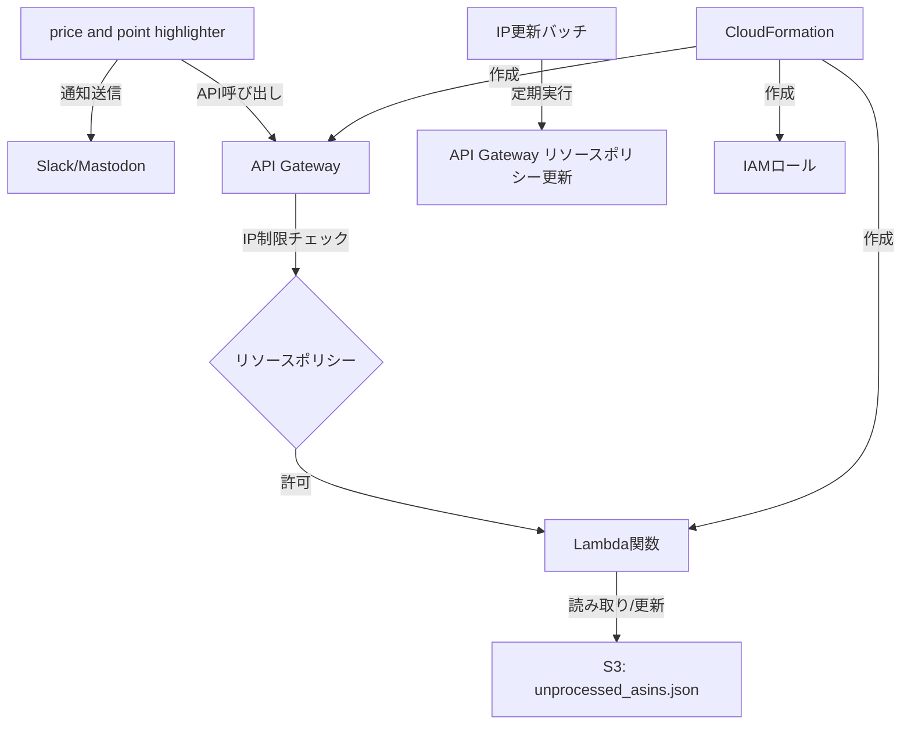

# 設計書

## 概要

price and point highlighterでSlack/Mastodonに通知したタイミングで、sale_checkerが使用するS3ファイル（`unprocessed_asins.json`）から通知済みASINのレコードを削除するシステムを設計します。システムは以下の5つのコンポーネントで構成されます：

1. CloudFormationテンプレート（インフラ構築）
2. IP更新バッチスクリプト（動的IP対応）
3. Go言語Lambda関数（S3ファイル更新）
4. Lambdaデプロイスクリプト（Go関数のデプロイ）
5. price and point highlighter修正（API呼び出し）

## アーキテクチャ



## コンポーネントと責務

### 1. CloudFormationテンプレート

**ファイル名:** `s3-asin-cleanup-infrastructure.yaml`

**責務:**
- API Gatewayの作成と設定
- Lambda関数リソースの定義（コードは別途デプロイ）
- IAMロールと権限の設定
- リソースポリシーの初期設定

**主要リソース:**
- `AWS::ApiGateway::RestApi`: メインAPI
- `AWS::ApiGateway::Resource`: `/cleanup` リソース
- `AWS::ApiGateway::Method`: DELETE メソッド
- `AWS::Lambda::Function`: S3更新Lambda（コードは空、後でデプロイ）
- `AWS::IAM::Role`: Lambda実行ロール
- `AWS::Lambda::Permission`: API Gateway実行権限

**注意:** Lambda関数のコードは別途デプロイスクリプト（`deploy-lambda.sh`）を使用してデプロイします。

### 2. IP更新バッチスクリプト

**ファイル名:** `update-api-gateway-ip.sh`

**責務:**
- 現在のパブリックIPアドレスの取得
- API Gatewayリソースポリシーの更新
- エラーハンドリングとログ出力

**主要機能:**
- `curl http://checkip.amazonaws.com` でIP取得
- AWS CLI使用してリソースポリシー更新
- 前回IPとの比較による不要な更新回避

### 3. Lambda関数（Go言語）

**ファイル名:** `main.go`

**責務:**
- API Gatewayリクエストの受信と検証
- S3ファイルの読み取りと解析
- 指定ASINのレコード削除
- 更新されたファイルのS3への保存

**主要構造:**
```go
type Event struct {
    ASIN string `json:"asin"`
}

type KindleBook struct {
    ASIN         string    `json:"ASIN"`
    Title        string    `json:"Title"`
    ReleaseDate  time.Time `json:"ReleaseDate"` // entity.Date (time.Timeのラッパー)
    CurrentPrice float64   `json:"CurrentPrice"`
    MaxPrice     float64   `json:"MaxPrice"`
    URL          string    `json:"URL"`
}

type Response struct {
    StatusCode int    `json:"statusCode"`
    Body       string `json:"body"`
}
```

### 4. Lambdaデプロイスクリプト

**ファイル名:** `deploy-lambda.sh`

**責務:**
- Go言語コードのビルド
- zipファイルの作成
- AWS CLIを使用したLambda関数の更新
- デプロイ結果の確認とログ出力

**主要機能:**
- `GOOS=linux GOARCH=amd64 go build` でLinux用バイナリ作成
- `zip` コマンドでデプロイパッケージ作成
- `aws lambda update-function-code` でコード更新

### 5. price and point highlighter修正

**修正対象:** `kindle/price_and_point_highlighter/main.js`

**責務:**
- 通知送信後のAPI Gateway呼び出し
- エラーハンドリング
- 重複呼び出し防止

## データモデル

### S3ファイル構造（unprocessed_asins.json）

```json
[
  {
    "ASIN": "B0FLBN81F2",
    "Title": "追放されるたびにスキルを手に入れた俺が、100の異世界で2周目無双【電子単行本】　5 (ヤングチャンピオン・コミックス)",
    "ReleaseDate": "2025-10-27T00:00:00Z",
    "CurrentPrice": 781,
    "MaxPrice": 792,
    "URL": "https://www.amazon.co.jp/dp/B0FLBN81F2?tag=shinderuman03-22&linkCode=ogi&th=1&psc=1"
  }
]
```

### API Gateway リクエスト形式

```json
{
  "asin": "B08XXXXXXX"
}
```

### Lambda レスポンス形式

```json
{
  "statusCode": 200,
  "body": "{\"message\": \"ASIN B08XXXXXXX removed successfully\", \"remainingCount\": 42}"
}
```

## インターフェース

### API Gateway エンドポイント

- **URL:** `https://{api-id}.execute-api.ap-northeast-1.amazonaws.com/prod/cleanup`
- **メソッド:** DELETE
- **Content-Type:** application/json
- **認証:** IPアドレス制限（リソースポリシー）

### Lambda関数インターフェース

```go
func handler(ctx context.Context, event Event) (Response, error)
```

**入力:**
- `event.ASIN`: 削除対象のASIN

**出力:**
- `Response.StatusCode`: HTTPステータスコード
- `Response.Body`: JSON形式のレスポンス

## エラーハンドリング

### Lambda関数エラー処理

1. **無効なASIN形式**
   - ステータス: 400
   - メッセージ: "Invalid ASIN format"

2. **S3読み取りエラー**
   - ステータス: 500
   - メッセージ: "Failed to read S3 file"

3. **ASIN未発見**
   - ステータス: 404
   - メッセージ: "ASIN not found"
   - 注意: UserScript側では404を無視して正常処理を継続

4. **S3書き込みエラー**
   - ステータス: 500
   - メッセージ: "Failed to update S3 file"

### price and point highlighter エラー処理

- API呼び出し失敗時もメイン処理は継続
- 404レスポンスは正常として扱い（存在しないASINへのリクエストは頻繁に発生）
- その他のエラーはログ出力のみ
- 通知機能への影響なし

## テスト戦略

### 単体テスト

1. **Lambda関数テスト**
   - 正常なASIN削除
   - 無効なASIN処理
   - S3エラー処理

2. **IP更新バッチテスト**
   - IP変更検出
   - AWS CLI呼び出し
   - エラーハンドリング

### 統合テスト

1. **API Gateway → Lambda → S3**
   - エンドツーエンドの動作確認
   - IP制限の動作確認

2. **price and point highlighter統合**
   - 通知送信とAPI呼び出しの連携
   - エラー時の動作確認

## セキュリティ考慮事項

### アクセス制御

- API GatewayリソースポリシーによるIP制限
- Lambda関数の最小権限IAMロール
- S3バケットへの限定的なアクセス権限

### データ保護

- HTTPS通信の強制
- ログに機密情報を含めない
- S3ファイルの適切な権限設定

## 運用考慮事項

### 監視とログ

- CloudWatch Logsによるログ収集
- Lambda関数の実行メトリクス監視
- API Gatewayのアクセスログ

### バックアップ

- S3ファイルのバージョニング有効化
- 削除前のファイル状態保持

### スケーラビリティ

- Lambda関数の同時実行制限設定
- API Gatewayのレート制限設定